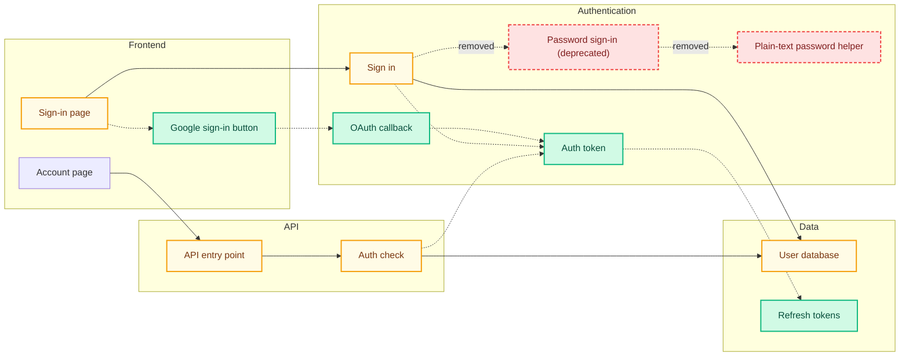

# mermaid-pr

A Claude Code **skill + subagent** pair that attaches a diff-aware Mermaid architecture diagram to every PR Claude creates on your behalf.

- **Skill** (`skill/SKILL.md`) — runs in the parent Claude Code session and dispatches the work.
- **Subagent** (`agent/mermaid-pr.md`) — runs in a fresh, isolated context, analyzes the PR diff, generates a Mermaid graph, validates it, and posts (or updates) a sticky PR comment.

The diagram is a fenced ```mermaid block, which GitHub renders inline natively. No image generation, no commits to the PR branch.

## What the diagram shows

Files in the PR's slice of the system, colored by diff status, with import/caller edges:

- 🟢 **green** — added in this PR
- 🟡 **yellow** — modified
- 🔴 **red dashed** — removed
- **solid** arrows — pre-existing imports
- **dotted** arrows — imports added or removed in this PR

Capped at ~30 nodes for readability.

## Example output

Here's what the skill posts on a fictional PR that adds Google OAuth sign-in alongside an existing password flow, and removes the legacy password-only path. This is the actual comment shape — plain-English summary, fenced ```mermaid block, legend.

> ## What this PR changes
>
> This PR adds Google OAuth sign-in alongside the existing password flow. Users can now sign in with their Google account, receive a short-lived access token plus a refresh token, and stay logged in across sessions. The deprecated password-only sign-in path and its plain-text password helper have been removed; the auth middleware was updated to recognize the new tokens.



Notice every node uses a human-readable label — no filenames, no paths, no extensions. Subgraphs group by purpose ("Authentication") rather than by directory ("src/auth"). A non-engineer can read this and understand the PR.

## Install

```bash
git clone <this-repo> ~/Desktop/mermaid-pr   # or wherever
cd ~/Desktop/mermaid-pr
bash install.sh                              # symlinks into ~/.claude/{skills,agents}/
```

No npm deps — the validator is pure Node stdlib.

One-time prereq (the subagent shells out to `gh`):

```bash
brew install gh
gh auth login
```

## Verify

```bash
node bin/validate-mermaid.mjs examples/sample-diff-diagram.mmd   # exit 0
```

In a fresh Claude Code session, `mermaid-pr` should appear in the available skills and subagents lists.

## How it triggers

Two reinforcing mechanisms:

1. The skill's `description` says "Use immediately after `gh pr create` succeeds." Claude Code's skill discovery picks this up.
2. A one-line nudge in `~/.claude/CLAUDE.md` reinforces it for sessions where description matching alone isn't enough.

## Manual invocation

If you want to attach a diagram to an existing PR (one Claude didn't just create), ask Claude:

> Run the mermaid-pr skill on PR #123.

The skill will pull the metadata via `gh pr view` and dispatch the subagent.

## Files

| Path | Purpose |
|---|---|
| `skill/SKILL.md` | Dispatcher — short instructions for the parent Claude |
| `agent/mermaid-pr.md` | Worker — full self-contained subagent definition |
| `bin/validate-mermaid.mjs` | Pre-post syntax check (structural; no deps) |
| `examples/prompt-template.md` | Exact prompt the skill passes to the subagent |
| `examples/sample-diff-diagram.mmd` | Reference output to anchor the subagent on |
| `install.sh` | Symlinks skill + subagent into `~/.claude/` |
| `package.json` | Validator script entry; no runtime deps |

## Troubleshooting

- **"gh not installed"** in the subagent's failure message → run `brew install gh && gh auth login`.
- **Diagram doesn't render on GitHub** → the Mermaid block is too large or has a syntax error. Run `node bin/validate-mermaid.mjs /tmp/mermaid-pr-*.mmd` against the temp file the subagent wrote.
- **Two diagram comments on the same PR** → the sticky marker (`<!-- mermaid-pr:diagram -->`) wasn't on the first line of the previous comment. Delete the older one manually; subsequent runs will edit the remaining one.
- **Skill doesn't appear in fresh session** → confirm `ls -la ~/.claude/skills/mermaid-pr` shows a valid symlink.
