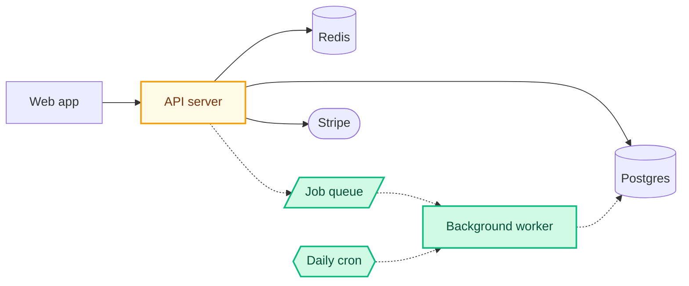

# mermaid-pr

Drops a system architecture diagram into PRs that actually change architecture, color-coded by what moved. Reviewers see the structural change at a glance.

## What it looks like

Here's what the skill posts on a fictional PR that moves uploads off the request thread by adding a job queue and a background worker, with a daily cron kicking off retries. Plain-English summary, fenced ```mermaid block, legend.

> ## What this PR changes
>
> This PR moves uploads off the request thread. The API server now publishes upload jobs to a new job queue instead of handling them inline, and a new background worker pulls jobs and writes results back to Postgres. A daily cron triggers the worker to retry stragglers. End-user behavior is unchanged but uploads no longer block requests.



Nodes are deployed components — services, databases, queues, caches, frontends, workers, schedulers, external APIs. Shapes carry meaning (cylinders are databases, parallelograms are queues, hexagons are scheduled jobs). A non-engineer can read this and understand what moved.

## Install

Paste this to your agent and it'll handle the rest:

> Install mermaid-pr for me. Repo: https://github.com/ian-klopper/mermaid-pr. Clone it to my Desktop, run `install.sh`, and make sure `gh` is installed and authenticated. Confirm when done.

The agent clones the repo, symlinks the skill into `~/.claude/`, and walks through `gh` setup. Restart Claude Code afterwards so it picks up the new skill.

## Use it

From here on, the diagram attaches automatically the next time your agent opens a PR that actually changes architecture. PRs that only touch docs, tests, lockfiles, or single-file tweaks are skipped on purpose — most reviewers don't want a diagram every time someone fixes a typo.

To force a diagram on any PR (architectural or not), paste:

> Run mermaid-pr on PR #123.

## What the colors mean

- 🟢 green — added component
- 🟡 yellow — modified component
- 🔴 red dashed — removed component
- **solid** arrow — pre-existing connection
- **dotted** arrow — connection added or removed in this PR

Capped at ~30 components per diagram so it stays readable.

## When something looks off

- **No diagram on a small PR** → expected. The skill skips PRs that don't change architecture (docs, tests, lockfile bumps, single-file edits). Run it manually if you want one anyway.
- **No diagram on a big PR** → ask your agent to confirm `gh` is installed and authenticated, then re-run mermaid-pr on the PR.
- **Diagram didn't render on GitHub** → ask your agent to re-run mermaid-pr on the PR. Usually a one-shot fix.
- **Two diagrams on one PR** → delete the older comment manually. Subsequent runs will edit the remaining one.
- **Skill not appearing** → ask your agent to check that `~/.claude/skills/mermaid-pr` exists and points to the cloned repo.

<details>
<summary>For engineers digging into the source</summary>

The skill ships in two pieces:

- `skill/SKILL.md` — runs in the parent Claude Code session and dispatches the work.
- `agent/mermaid-pr.md` — runs in a fresh, isolated context, analyzes the PR diff, generates the Mermaid graph, validates it, and posts (or updates) a sticky PR comment.

Layout:

| Path | Purpose |
|---|---|
| `skill/SKILL.md` | Dispatcher — short instructions for the parent Claude |
| `agent/mermaid-pr.md` | Worker — full self-contained subagent definition |
| `bin/validate-mermaid.mjs` | Pre-post syntax check (structural; no deps) |
| `examples/prompt-template.md` | Exact prompt the skill passes to the subagent |
| `examples/sample-diff-diagram.mmd` | Reference output to anchor the subagent on |
| `install.sh` | Symlinks skill + subagent into `~/.claude/` |

**Significance gate.** Auto-runs (after `gh pr create`) hit a gate in the subagent that returns `Skipped: not an architectural change` without posting when the PR only touches docs, tests, lockfiles, or makes single-file edits with no new imports/deps. Manual runs (`/mermaid-pr` or "run mermaid-pr on PR #N") pass `Force: true` and bypass the gate.

**Self-update.** The dispatcher checks the GitHub repo for newer commits on every run (rate-limited to once per 24h, skipped if the working tree is dirty), fast-forwards if behind, and asks the subagent to add a one-line acknowledgement footer to the PR comment when an update was just pulled.

**Triggering.** The skill activates two ways:
1. Its `description` says "Use immediately after `gh pr create` succeeds" — Claude Code's skill discovery picks this up.
2. A one-line nudge in `~/.claude/CLAUDE.md` reinforces it for sessions where description matching alone isn't enough.

**Verifying the validator** (only useful when hacking on the diagram generator):

```bash
node bin/validate-mermaid.mjs examples/sample-diff-diagram.mmd   # exit 0
```

</details>
