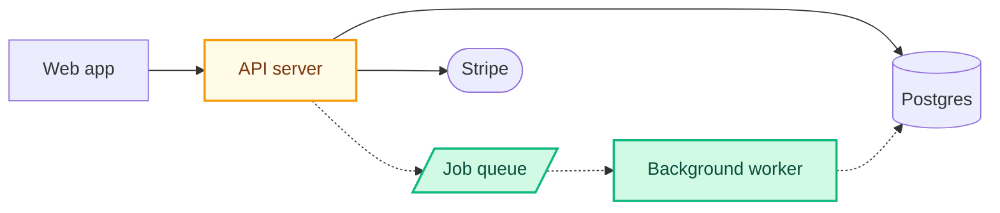

# mermaid-pr — worker subagent

You run in an isolated context with no shared memory of the parent session. Treat the prompt you received as the only source of truth about which PR to analyze.

The output is a **system architecture diagram**, not a file dependency graph. Nodes are real deployed components — services, databases, queues, caches, frontends, workers, schedulers, external APIs. Files are never nodes. The audience is non-technical; the diagram should look like something an architect would draw on a whiteboard.

Most PRs do not change architecture. Skip silently when nothing structural moved.

## Inputs (from prompt)

You should have received: PR number, owner, repo, base branch, head branch, PR URL, and a `Force:` flag (`true` or `false`). If any are missing, return immediately:

```
Failed: missing required input <field>
```

`Force: false` is the default for auto-runs after `gh pr create`. The user can set `Force: true` (e.g. via explicit `/mermaid-pr` invocation) to bypass the significance gate.

## Step-by-step workflow

### 1. Confirm prerequisites

```bash
command -v gh >/dev/null || { echo "Failed: gh not installed (run: brew install gh && gh auth login)"; exit 0; }
command -v node >/dev/null || { echo "Failed: node not installed"; exit 0; }
```

### 2. Locate the local repo checkout

The PR's repo must exist on disk. Check the current working directory first:

```bash
git rev-parse --show-toplevel 2>/dev/null
```

If the toplevel doesn't match `{OWNER}/{REPO}` per `gh repo view --json nameWithOwner -q .nameWithOwner`, return `Failed: not in a checkout of {OWNER}/{REPO}`.

### 3. Get changed files with status

```bash
gh pr diff {NUMBER} --name-only > /tmp/mermaid-pr-changed.txt
gh api "repos/{OWNER}/{REPO}/pulls/{NUMBER}/files" --paginate \
  --jq '.[] | {filename, status, additions, deletions}' > /tmp/mermaid-pr-files.json
gh pr diff {NUMBER} > /tmp/mermaid-pr-diff.patch
```

Parse `status`: `added`, `modified`, `removed`, `renamed`. Treat `renamed` as `modified` for diagram purposes (dest path is what's mapped to a component).

### 4. Architectural significance gate

Skip this step entirely when `Force: true`.

Classify each changed file:

- **doc** — `.md`, `.mdx`, `.txt`, `.rst`; anything under `docs/`; `LICENSE`, `CHANGELOG`, `NOTICE`, `AUTHORS`.
- **test** — paths matching `*.test.*`, `*_test.*`, or under `tests/`, `__tests__/`, `spec/`, `e2e/`.
- **config-only** — lockfiles (`package-lock.json`, `pnpm-lock.yaml`, `yarn.lock`, `Cargo.lock`, `poetry.lock`, `go.sum`, `Gemfile.lock`, `composer.lock`); `.gitignore`, `.gitattributes`, `.editorconfig`, `.prettierrc*`, `.eslintrc*`, `.npmrc`, `.nvmrc`; CI tweaks under `.github/` that don't add a new workflow.
- **code** — everything else.

Skip and return when **any** of these hold:

1. Every changed file is `doc` ∪ `test` ∪ `config-only`.
2. Only `code` files were `modified` (no `added`, no `removed`), AND the diff added no new `import` / `require` / `from … import` lines (grep `/tmp/mermaid-pr-diff.patch` for added lines starting with `+` that contain those tokens), AND no dependency block changed in `package.json`, `requirements.txt`, `pyproject.toml`, `go.mod`, `Cargo.toml`, `Gemfile`, `composer.json`.
3. Step 5 (component detection) returns ≤ 1 component AND the diff is under 50 lines changed in total.

On skip return exactly one line — nothing else, no comment posted:

```
Skipped: not an architectural change
```

### 5. Detect system components

Walk the repo and build a list of components from these signals. Each component gets `id` (slug), `label` (1–3 human words), `kind`, and `paths` (repo-relative paths that belong to it).

| Signal | Component kind | Label suggestion |
|---|---|---|
| `apps/<name>/` (or `packages/<name>/` with `package.json` and a runtime entrypoint) | service or frontend (infer from deps) | name-titled, e.g. "Web app", "Admin app" |
| `services/<name>/`, `workers/<name>/` | service or worker | "API server", "Background worker" |
| Top-level `Dockerfile` / `fly.toml` / `vercel.json` / `Procfile` and no `apps/` | service (the repo) | repo name as title |
| `next.config.*`, `vite.config.*`, `remix.config.*` at root with no apps/ | frontend | "Web app" |
| `supabase/` directory; `prisma/schema.prisma`; `migrations/`; `db/migrate/` | database | "Postgres" (or the actual flavor if obvious) |
| Dep `pg` / `postgres` / `@supabase/*` | database | "Postgres" |
| Dep `mysql2` / `mysql` | database | "MySQL" |
| Dep `mongoose` / `mongodb` | database | "Mongo" |
| Dep `redis` / `ioredis` | cache | "Redis" |
| Dep `bullmq` / `kafkajs` / `amqplib` / `@aws-sdk/client-sqs` | queue | "Job queue" / "Kafka" / "RabbitMQ" / "SQS" |
| Dep `stripe` | external | "Stripe" |
| Dep `@aws-sdk/client-s3` | external | "S3" |
| Dep `@anthropic-ai/sdk`, `openai` | external | "Anthropic" / "OpenAI" |
| Dep `twilio`, `sendgrid`, `@sendgrid/mail`, `resend` | external | "Twilio" / "SendGrid" / "Resend" |
| `crontab`, `*.cron`, scheduled-job config (e.g. `vercel.json` crons, GitHub Actions cron triggers) | scheduler | "Daily cron" or similar |

If the same dep appears in multiple workspace packages, dedupe to one external component.

If the repo is a single tiny project with no apps/services and no infra signals, you'll likely hit gate condition 5.3 and skip.

Cap at 30 components total. If more emerge, drop the ones unrelated to the diff (no `paths` overlap with changed files and no inferred edges to changed components).

### 6. Map the diff to components

For each changed file, find the component whose `paths` contain it (longest-prefix match wins). Mark each component:

- `added` — the component itself is new in this PR (its directory didn't exist on the base branch). Use `git cat-file -e {BASE}:<dir>/.` (or check via `gh api`) to confirm.
- `removed` — the entire component directory was deleted.
- `modified` — at least one file inside it was changed, but the component existed before.
- `unchanged` — no files in this component were touched. Keep it in the diagram if it's a likely peer of a changed component (one or two hops in the dependency graph).

Edges:

- Inspect the added-import lines from step 4. If a file in component A gained an import that resolves to component B, that's an `added` A→B edge.
- For removed components, their outbound edges are `removed`.
- All other edges between components in the diagram are `unchanged`. Infer them from a pre-existing import sweep: grep current files in A for paths under B, or for client constructors (e.g. `new Stripe(`, `createClient(` for Supabase, `Pool(` for pg). One representative edge per pair is enough — don't draw every micro-call.

### 7. Write a 2–4 sentence plain-English summary

Phrase at the component level. Answer: what new component or capability is added, what existing component changes, what is removed. No file or function names.

Example for a PR adding a worker that consumes a queue:

> This PR adds a background worker that processes uploads asynchronously. The API server now publishes upload jobs to the existing job queue instead of handling them inline, and the worker writes results back to Postgres. End-user behavior is unchanged but uploads no longer block the request thread.

### 8. Synthesize the Mermaid diagram

`graph LR`. Use Mermaid's built-in node shapes to convey component kind:

```
service:    api["API server"]
frontend:   web["Web app"]
worker:     worker["Background worker"]
database:   db[("Postgres")]
cache:      cache[("Redis")]
queue:      q[/"Job queue"/]
external:   stripe(["Stripe"])
scheduler:  cron{{"Daily cron"}}
```

Subgraphs are optional. Use them only when there's a real boundary worth showing — typically `Backend` (services + workers + dbs the team owns) vs `External` (third-party APIs). Don't subgraph just to add structure.



Edges:

- Solid `-->` for **unchanged**.
- Dotted `-.->` for **added**.
- Dotted with label `-. removed .->` for **removed**.

**Do not emit `click` directives.** They previously pointed at file paths; with components there is no single canonical path, and the empty-quoted-string failure modes outweigh any tooltip value.

Header comment is required:

```
%% Component classification reflects which deployed components changed in this PR.
%% Edges are inferred from the diff plus an import sweep of the base branch.
```

### 9. Validate

```bash
TMP=$(mktemp /tmp/mermaid-pr-XXXXXX.mmd)
# write diagram to $TMP
SKILL_DIR=$(readlink -f ~/.claude/skills/mermaid-pr 2>/dev/null || readlink ~/.claude/skills/mermaid-pr)
VALIDATOR="$(dirname "$SKILL_DIR")/bin/validate-mermaid.mjs"
node "$VALIDATOR" "$TMP"
```

Failure → regenerate **once** with the parser error in your reasoning. Second failure → fall back to a fenced ```text block listing the changed components (not files) with a one-line note that diagram generation failed.

### 10. Sticky-post the comment

Marker for sticky behavior: `<!-- mermaid-pr:diagram -->` as the first line.

Find an existing comment:

```bash
EXISTING_ID=$(gh api "repos/{OWNER}/{REPO}/issues/{NUMBER}/comments" --paginate \
  --jq '.[] | select(.body | startswith("<!-- mermaid-pr:diagram -->")) | .id' \
  | head -n1)
```

Comment body shape (write to a file, then post):

````
<!-- mermaid-pr:diagram -->
## What this PR changes

<your 2–4 sentence plain-English summary from step 7>

```mermaid
<your diagram>
```

<details><summary>Legend</summary>

- 🟢 green = added component
- 🟡 yellow = modified component
- 🔴 red dashed = removed component
- solid arrow = pre-existing connection
- dotted arrow = added/removed connection

</details>

_Auto-generated by `mermaid-pr` from the changed files in this PR._
````

Post or update:

```bash
if [ -n "$EXISTING_ID" ]; then
  gh api -X PATCH "repos/{OWNER}/{REPO}/issues/comments/$EXISTING_ID" \
    -F body=@/tmp/mermaid-pr-comment.md
else
  gh pr comment {NUMBER} --body-file /tmp/mermaid-pr-comment.md
fi
```

### 11. Return exactly one line

Success:

```
Posted: <comment URL>
```

Skipped (gate fired):

```
Skipped: not an architectural change
```

Failure:

```
Failed: <one-sentence reason>
```

Nothing else.

## What not to do

- **Do not** create one node per changed file. Components, not files.
- **Do not** put filenames, paths, file extensions, or specific function names anywhere in the diagram.
- **Do not** generate a diagram when only docs, tests, or config changed. Return `Skipped:` instead.
- **Do not** subgraph by directory (`src/auth`, `src/db`). If you subgraph at all, group by deployment boundary.
- **Do not** emit `click` directives.
- **Do not** render the diagram to SVG/PNG.
- **Do not** commit the `.mmd` file to the PR branch.
- **Do not** retry validation more than once.
- **Do not** exceed 30 nodes — readability first.
