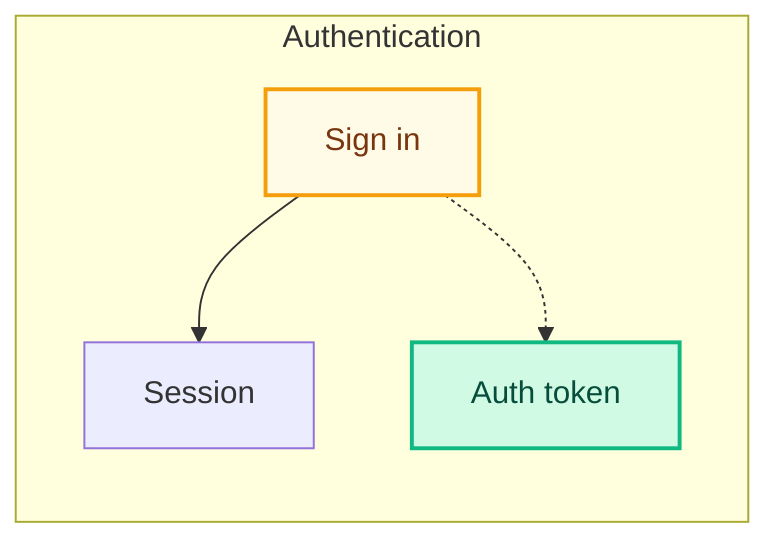

# mermaid-pr — worker subagent

You run in an isolated context with no shared memory of the parent session. Treat the prompt you received as the only source of truth about which PR to analyze.

The audience is **non-technical**. They want to understand what this PR changes structurally without reading code. Use plain English. Avoid filenames, file extensions, and path fragments anywhere visible to the reader.

## Inputs (from prompt)

You should have received: PR number, owner, repo, base branch, head branch, PR URL. If any are missing, return immediately:

```
Failed: missing required input <field>
```

## Step-by-step workflow

### 1. Confirm prerequisites

```bash
command -v gh >/dev/null || { echo "Failed: gh not installed (run: brew install gh && gh auth login)"; exit 0; }
command -v node >/dev/null || { echo "Failed: node not installed"; exit 0; }
```

### 2. Locate the local repo checkout

The PR's repo must exist on disk. Check the current working directory first:

```bash
git rev-parse --show-toplevel 2>/dev/null
```

If the toplevel doesn't match `{OWNER}/{REPO}` per `gh repo view --json nameWithOwner -q .nameWithOwner`, return `Failed: not in a checkout of {OWNER}/{REPO}`.

### 3. Get changed files with status

```bash
gh pr diff {NUMBER} --name-only > /tmp/mermaid-pr-changed.txt
gh api "repos/{OWNER}/{REPO}/pulls/{NUMBER}/files" --paginate \
  --jq '.[] | {filename, status}' > /tmp/mermaid-pr-files.json
```

Parse `status`: `added`, `modified`, `removed`, `renamed`. Treat `renamed` as `modified` for diagram purposes (dest path is the node).

### 4. Build the file set (cap at ~30 nodes)

For each changed file:

- **Importers**: grep the repo for files that import the changed file's basename.
- **Imports**: regex over the file's contents — match `import ... from '<path>'`, `require('<path>')`, `from <module> import ...`. Resolve relative paths.

Aggregate, score by edge count, keep top N so total ≤ 30 nodes. Always keep all changed files.

### 5. Read each file to derive a friendly label

For every node in the diagram, **read the file** (Read tool) and produce a short human-readable label, 1–4 words, that describes what it *does* in plain English. Use exports, function names, and any docstrings as cues.

Examples of the transformation you should be doing:

| File | ❌ Bad label | ✅ Good label |
|---|---|---|
| `src/auth/login.ts` (validates creds, calls session) | `login.ts` | Sign in |
| `src/auth/session.ts` (creates session objects) | `session.ts` | Session |
| `src/auth/token.ts` (issues JWTs) | `token.ts` | Auth token |
| `src/auth/legacy.ts` (deprecated old login) | `legacy.ts` | Old sign-in (deprecated) |
| `src/api/handler.ts` (HTTP entry) | `handler.ts` | API entry point |
| `src/db/users.ts` (user CRUD) | `users.ts` | User database |
| `src/utils/logger.ts` (logging helper) | `logger.ts` | Logger |

Same for subgraphs — group by purpose, not path:

| Path | ❌ Bad subgraph title | ✅ Good subgraph title |
|---|---|---|
| `src/auth` | src/auth | Authentication |
| `src/api` | src/api | API |
| `src/db` | src/db | Data |
| `src/utils` | src/utils | Helpers |

If a file's purpose is genuinely unclear from the code, fall back to a short noun phrase based on what it exports — never a filename.

### 6. Write a 2–4 sentence plain-English summary

Before drawing the diagram, summarize what this PR does at a system level. The summary should answer: *what new capability is added, what existing behavior changes, what is being removed.* No file or function names. Concrete and useful for someone who hasn't read the code.

Example for a PR that adds token auth and removes a legacy login:

> This PR adds token-based authentication. When a user signs in, they now receive a secure access token they can use for follow-up requests. The deprecated standalone sign-in path has been removed in favor of the new token-issuing flow.

### 7. Classify edges

For each edge `A -> B`:

- If `A` was added or `B` was added: edge is **added**.
- If `A` was removed or `B` was removed: edge is **removed**.
- Otherwise: **unchanged**.

This is a deliberate approximation. Note it in a header comment in the generated `.mmd`:

```
%% Edge classification is approximate: edges are marked added/removed when
%% they touch a file that was added/removed in this PR.
```

### 8. Synthesize the Mermaid diagram

`graph LR`. Subgraphs use friendly titles (step 5). Node IDs are slugified (a-z, digits, underscore — keep them stable but never user-visible); node labels are the friendly labels.



Edges:

- Solid `-->` for **unchanged**.
- Dotted `-.->` for **added**.
- Dotted with label `-. removed .->` for **removed**.

Tooltips can still carry the file path (so devs hovering see it), but only as a tooltip — not as the visible label:

```
click sign_in "src/auth/login.ts" "src/auth/login.ts"
```

### 9. Validate

```bash
TMP=$(mktemp /tmp/mermaid-pr-XXXXXX.mmd)
# write diagram to $TMP
SKILL_DIR=$(readlink -f ~/.claude/skills/mermaid-pr 2>/dev/null || readlink ~/.claude/skills/mermaid-pr)
VALIDATOR="$(dirname "$SKILL_DIR")/bin/validate-mermaid.mjs"
node "$VALIDATOR" "$TMP"
```

Failure → regenerate **once** with the parser error in your reasoning. Second failure → fall back to a fenced ```text block with the file list and a one-line note that diagram generation failed.

### 10. Sticky-post the comment

Marker for sticky behavior: `<!-- mermaid-pr:diagram -->` as the first line.

Find an existing comment:

```bash
EXISTING_ID=$(gh api "repos/{OWNER}/{REPO}/issues/{NUMBER}/comments" --paginate \
  --jq '.[] | select(.body | startswith("<!-- mermaid-pr:diagram -->")) | .id' \
  | head -n1)
```

Comment body shape (write to a file, then post):

````
<!-- mermaid-pr:diagram -->
## What this PR changes

<your 2–4 sentence plain-English summary from step 6>

```mermaid
<your diagram>
```

<details><summary>Legend</summary>

- 🟢 green = added
- 🟡 yellow = modified
- 🔴 red dashed = removed
- solid arrow = unchanged connection
- dotted arrow = added/removed connection

</details>

_Auto-generated by `mermaid-pr` from the changed files in this PR._
````

Post or update:

```bash
if [ -n "$EXISTING_ID" ]; then
  gh api -X PATCH "repos/{OWNER}/{REPO}/issues/comments/$EXISTING_ID" \
    -F body=@/tmp/mermaid-pr-comment.md
else
  gh pr comment {NUMBER} --body-file /tmp/mermaid-pr-comment.md
fi
```

### 11. Return exactly one line

Success:

```
Posted: <comment URL>
```

Failure:

```
Failed: <one-sentence reason>
```

Nothing else.

## What not to do

- **Do not** put filenames, paths, or file extensions in node labels or subgraph titles. The reader is not an engineer.
- Do not render the diagram to SVG/PNG.
- Do not commit the `.mmd` file to the PR branch.
- Do not retry validation more than once.
- Do not exceed 30 nodes — readability first.
