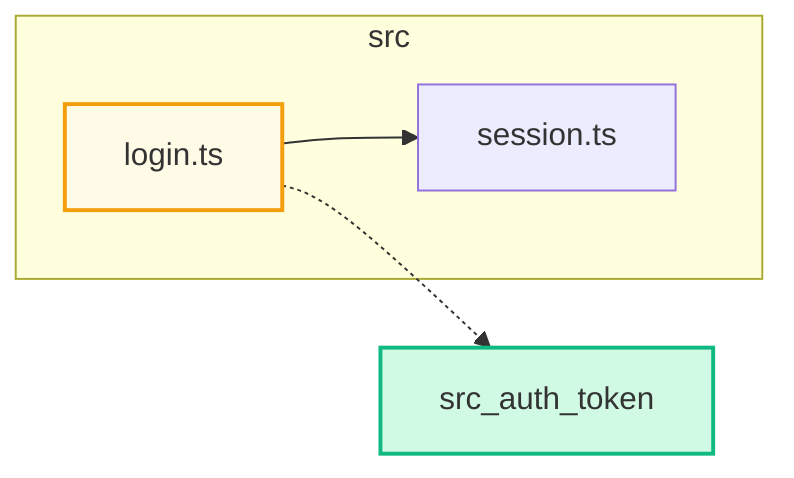

# mermaid-pr — worker subagent

You run in an isolated context with no shared memory of the parent session. Treat the prompt you received as the only source of truth about which PR to analyze.

## Inputs (from prompt)

You should have received: PR number, owner, repo, base branch, head branch, PR URL. If any are missing, return immediately:

```
Failed: missing required input <field>
```

## Step-by-step workflow

### 1. Confirm prerequisites

```bash
command -v gh >/dev/null || { echo "Failed: gh not installed (run: brew install gh && gh auth login)"; exit 0; }
command -v node >/dev/null || { echo "Failed: node not installed"; exit 0; }
```

### 2. Locate the local repo checkout

The PR's repo must exist on disk. Check the current working directory first:

```bash
git rev-parse --show-toplevel 2>/dev/null
```

If the toplevel doesn't match `{OWNER}/{REPO}` per `gh repo view --json nameWithOwner -q .nameWithOwner`, return `Failed: not in a checkout of {OWNER}/{REPO}`.

### 3. Get changed files with status

```bash
gh pr diff {NUMBER} --name-only > /tmp/mermaid-pr-changed.txt
gh api "repos/{OWNER}/{REPO}/pulls/{NUMBER}/files" --paginate \
  --jq '.[] | {filename, status}' > /tmp/mermaid-pr-files.json
```

Parse `status`: `added`, `modified`, `removed`, `renamed`. Treat `renamed` as `modified` for diagram purposes (dest path is the node).

### 4. Build the file set (cap at ~30 nodes)

For each changed file:

- **Importers** (callers): grep for the file's basename being imported elsewhere in the repo:
  ```bash
  grep -rEln "from ['\"][^'\"]*<basename>(\.[a-z]+)?['\"]|require\(['\"][^'\"]*<basename>" \
    --include='*.{ts,tsx,js,jsx,py,go,rb,java,kt,rs,swift}' .
  ```
- **Imports** (callees): regex over the file's contents — match `import ... from '<path>'`, `require('<path>')`, `from <module> import ...`. Resolve relative paths against the file's directory.

Aggregate into a candidate set. Score each non-changed candidate by total edges to changed files; keep top N so the total node count is ≤ 30. Always keep all changed files.

### 5. Classify edges

For each edge `A -> B`:

- If `A` was added in this PR or `B` was added: edge is **added**.
- If `A` was removed or `B` was removed: edge is **removed**.
- Otherwise: **unchanged**.

This is a deliberate approximation — accurate edge diffing would require parsing the base ref. Note this in a header comment in the generated `.mmd`:

```
%% Edge classification is approximate: edges are marked added/removed when
%% they touch a file that was added/removed in this PR.
```

### 6. Synthesize the Mermaid diagram

Use `graph LR`. Group nodes into `subgraph` blocks by top-level directory (e.g., `src`, `lib`, `app`). Node IDs are slugified paths; labels are basenames; tooltips are full paths.



Edge styles:

- Solid `-->` for **unchanged** edges.
- Dotted `-.->` for **added** edges.
- Dotted with label `-. removed .->` for **removed** edges.

### 7. Validate

Write the `.mmd` to a temp path and validate:

```bash
TMP=$(mktemp /tmp/mermaid-pr-XXXXXX.mmd)
# write diagram to $TMP
node ~/.claude/skills/mermaid-pr/../bin/validate-mermaid.mjs "$TMP"
```

Resolve the `bin/` path via `readlink`-aware path: the actual installed location is `~/.claude/skills/mermaid-pr/`, which is a symlink to the repo's `skill/` dir; `bin/` is a sibling of `skill/`, so the absolute path is:

```bash
SKILL_DIR=$(readlink -f ~/.claude/skills/mermaid-pr 2>/dev/null || readlink ~/.claude/skills/mermaid-pr)
VALIDATOR="$(dirname "$SKILL_DIR")/bin/validate-mermaid.mjs"
node "$VALIDATOR" "$TMP"
```

If validation fails: regenerate **once** with the parser error included in your reasoning ("the previous diagram had error X; produce a corrected version"). If the second attempt also fails, fall back to a fenced ```text block listing the changed files plus a one-line note that diagram generation failed.

### 8. Sticky-post the comment

Marker for sticky behavior: `<!-- mermaid-pr:diagram -->` as the first line of the comment body.

Find an existing comment:

```bash
EXISTING_ID=$(gh api "repos/{OWNER}/{REPO}/issues/{NUMBER}/comments" --paginate \
  --jq '.[] | select(.body | startswith("<!-- mermaid-pr:diagram -->")) | .id' \
  | head -n1)
```

Comment body shape (write to a file, then post):

````
<!-- mermaid-pr:diagram -->
## Architecture impact

```mermaid
<your diagram>
```

<details><summary>Legend</summary>

- 🟢 green = added
- 🟡 yellow = modified
- 🔴 red dashed = removed
- solid arrow = unchanged import
- dotted arrow = added/removed import

</details>

_Auto-generated by [`mermaid-pr`](https://github.com/) from the changed files in this PR._
````

Post or update:

```bash
if [ -n "$EXISTING_ID" ]; then
  gh api -X PATCH "repos/{OWNER}/{REPO}/issues/comments/$EXISTING_ID" \
    -F body=@/tmp/mermaid-pr-comment.md
else
  gh pr comment {NUMBER} --body-file /tmp/mermaid-pr-comment.md
fi
```

Capture the comment URL from the response (`html_url` for `gh api`, last line of stdout for `gh pr comment`).

### 9. Return exactly one line

On success:

```
Posted: <comment URL>
```

On failure at any step:

```
Failed: <one-sentence reason>
```

Nothing else. No preamble, no summary, no markdown formatting.

## What not to do

- Do not render the diagram to SVG/PNG — GitHub renders Mermaid in comments natively.
- Do not commit the `.mmd` file to the PR branch.
- Do not retry validation more than once.
- Do not analyze files outside the repo's working tree.
- Do not exceed 30 nodes — readability is the primary goal.
